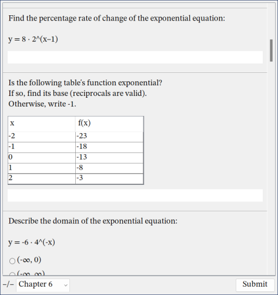
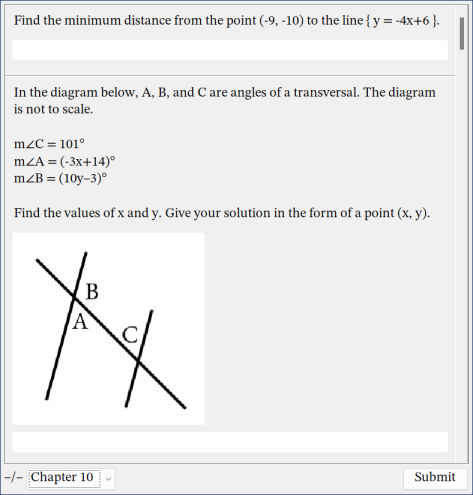

# whetstone
*a light-weight framework for graphical quiz generation*

Whetstone comes in an empty parent project containing two modules: the `whetstone-framework` library, and an example `whetstone-app` implementation. The example app targets the second half of Larson and Boswell's [*Big Ideas Math: Integrated Mathematics I*](https://bim.easyaccessmaterials.com/index.php?location_user=im).

Whetstone is built with and requires Java SE 17 or higher.

## building

Whetstone uses the build tool and package manager [Apache Maven](https://maven.apache.org/). Once installed, simply run the following command in the root directory:
```
mvn package
```
* `whetstone-framework` artifact will be output to `/whetstone-framework/target/whetstone-framework-*.jar`
* `whetstone-app` artifact will be output to `/whetstone-app/target/whetstone-app-*.jar`, with its required dependencies placed in `/whetstone-app/target/lib/`.
    * The executable JAR will *not* run successfully without the `lib/` directory next to it, so if the JAR is moved, the `lib/` directory must be moved along with it.

## screenshots





## todo

See [TODO.md](/TODO.md) for a rough, makeshift list of planned features. Of course, there is absolutely zero guarantee that any of these features will be implemented in the future, as Whetstone remains a hobby project (a stress reliever and distraction, really).

## credit

Whetstone's concept is based off of a good friend's AP Computer Science A final project submission, also written in Java: [briankhoi/2ndSemMath1Finals](https://github.com/briankhoi/2ndSemMath1Finals).
